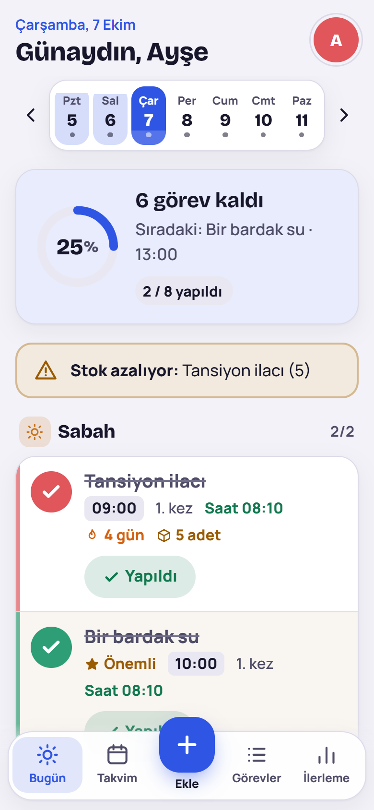
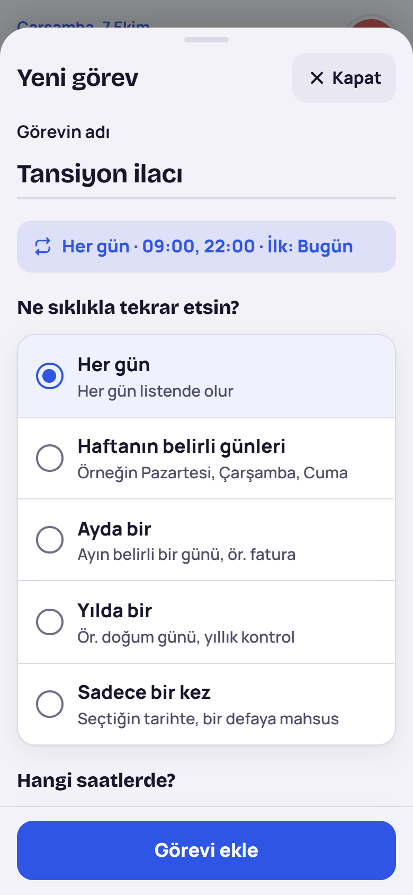
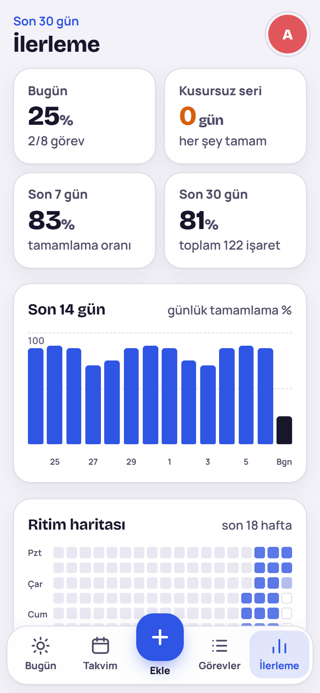
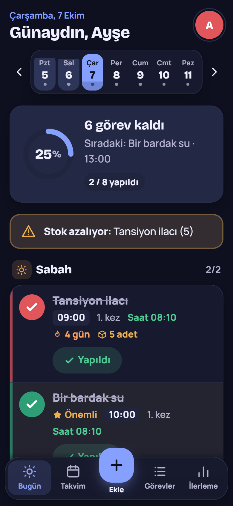

<p align="center">
  
</p>

<h1 align="center">Ritim</h1>

<p align="center">
  A mobile-first tracker for things that repeat: medication, habits, chores and bills.<br>
  Finished tasks aren't deleted. They come back every day, week, month or year.
</p>

<p align="center">
  <a href="https://ritim-production.up.railway.app"><strong>Open the app →</strong></a>
  &nbsp;·&nbsp; Turkish interface &nbsp;·&nbsp; Free, works offline, optional sync server
</p>

> [!NOTE]
> **This is a vibe-coded project.** All of the code, the visual design and this README were written by an AI (Anthropic's Claude, working in Claude Code) from plain-language requests in Turkish. My part was describing what I wanted, trying each version on my phone and asking for changes. I did not write the code and I have not reviewed it line by line. It ships with an automated end-to-end test suite, but please treat it as a personal hobby project, not audited software.

> [!WARNING]
> **Ritim is not a medical device.** Don't rely on it as your only medication reminder. Reminders only appear while the app is open or running in the background, and data lives in your browser, so clearing site data deletes it unless you have a backup.

<p align="center">
  
  
  
  
</p>

## Why

A normal to-do list wants you to tick a task off and forget it. Taking a pill twice a day, watering plants every three days or paying a bill on the 15th doesn't work that way. Ritim keeps those tasks in place and asks you again each time they are due. It was also built so that older family members can use it: big text, strong contrast and a word next to every icon.

## Features

**Schedules**
- Every day, or every *N* days
- Chosen weekdays (Mon / Wed / Fri, weekdays only, weekends), optionally every *N* weeks
- A day of the month, including "last day of the month"; day 31 falls back gracefully in short months
- Yearly (birthdays, annual check-ups), and one-off tasks that show as overdue until done
- Several times a day. Each dose is checked off separately
- Optional start and end dates ("antibiotic for 7 days")

**Daily use**
- *Today* screen with a weekly pill-organizer strip, a progress ring and morning / afternoon / evening / night groups
- A clear **Yaptım** ("Done") button on every task, the time it was done, and a red warning when a time has passed
- Streaks per task plus a "perfect day" streak; skipping a day doesn't break it
- Medication stock: counts down with each dose, warns when it runs low and estimates how many days are left
- Important (starred) tasks, categories with colors and icons, pause, undo after delete
- In-app reminders when a task's time arrives, plus system notifications if you allow them

**Overview**
- Month calendar showing how complete each day was
- Task list with search and filters
- Progress page: 7- and 30-day completion, a 14-day chart, an 18-week heatmap, your most and least consistent weekday, per-task rates

**Comfort and accessibility**
- Text size setting (Normal / Large / Extra large) that scales the whole interface
- Large touch targets, high-contrast colors, labelled buttons
- A calm look with a little colour: a tinted progress card, a soft colour for each time of day and a thin stripe per category. A deep navy dark theme
- Light and dark themes, six accent colors
- Nothing scrolls sideways on any screen size, from small phones to large monitors

**Your data**
- **Sync between devices** with the optional server: sign in with the same account on your phone and computer and changes show up on both
- Accounts with username and password, plus a one-time recovery code for resetting a forgotten password
- JSON backup and restore for moving to a new phone
- Installable as an app (PWA) and usable offline

## Use it on your phone

1. Open **https://ritim-production.up.railway.app** on the phone. Your account and tasks sync between all devices you sign in on.
   There is also an on-device version at https://yavuzkrm.github.io/ritim/, which keeps everything in that browser only.
2. Add it to the home screen:
   - **Android (Chrome):** menu ⋮ → *Add to Home screen* / *Install app*
   - **iPhone (Safari):** Share → *Add to Home Screen*
3. Create an account and add your first task, or tap *Örnek görevlerle dene* to start with examples.

Each phone keeps its own data. To move to another device, use **Ayarlar → Yedeği indir** on the old one and **Yedekten geri yükle** on the new one.

## How it works

- **One file.** The whole app is [`src/app.html`](src/app.html): HTML, CSS and vanilla JavaScript, with no framework and no runtime dependencies besides Google Fonts.
- **Three places to store data, one app.** All storage goes through a small `Store` layer, so the same file works:
  - on **GitHub Pages**, with no server: everything stays in the browser's `localStorage`;
  - with the **Ritim server** in [`server/`](server/): accounts and data live in SQLite and every device signed in to the account stays in sync (see [Sync server](#sync-server));
  - as a [claude.ai](https://claude.ai) artifact, using the artifact's per-user database.
- **Passwords.** With the server they are hashed with scrypt on the server and sessions use HTTP-only cookies. On GitHub Pages they are hashed in the browser with PBKDF2-SHA256 (120,000 iterations, random salt per account). That keeps casual users of a shared phone out of each other's lists, but it is not server-grade security, because anyone with access to the browser's storage can read the task data itself.
- **Offline.** A small service worker caches the app; the page is fetched network-first so updates still arrive.
- **Build.** [`scripts/build.js`](scripts/build.js) wraps the fragment in a full HTML document and writes `docs/` with the web app manifest, service worker and icons. GitHub Pages serves `docs/` from the `main` branch.

## Sync server

Live at **https://ritim-production.up.railway.app**.

A small Node.js server ([`server/`](server/), Express + better-sqlite3) serves the same `docs/` build and adds an API for accounts and data. The page it serves carries a `<meta name="ritim-server">` tag, which is how the app knows to use the server instead of the browser's storage.

- **Data model.** The app keeps its state in a few JSON documents per person: `app_<id>` for tasks, categories and settings, and `h_<id>_<YYYY-MM>` for each month of history. The server stores them in a `docs` table, scoped to the signed-in user.
- **Sync.** Every write bumps a per-user revision number. Each device asks for documents changed since the last revision it saw: every 15 seconds while the app is open, and right away when the app comes back to the foreground or the connection returns. If two devices change the same document at the same moment, the later save wins.
- **Accounts.** Sign-up, sign-in, recovery-code reset, password change and account deletion all go through the API. Resetting or changing the password signs out the other devices. Auth endpoints are rate limited.

### Run it locally

```bash
npm install
npm run build        # src/app.html → docs/
npm start            # http://localhost:3000
```

The database is created at `data/ritim.db`. Set `DATA_DIR` (or `DB_FILE`) to put it somewhere else and `PORT` to change the port.

### Deploy on Railway

The repo includes a `Dockerfile` and `railway.json`.

1. On [Railway](https://railway.com), create a new project and choose **Deploy from GitHub repo** → `ritim`.
2. Add a **Volume** to the service, mounted at `/data`. This is where the SQLite database lives. Without a volume, data is lost on every redeploy.
3. Under **Settings → Networking**, generate a public domain.

Railway sets `PORT` automatically. The health check is `/api/health`.

## Project structure

```
.
├── src/
│   └── app.html            # the entire app (single-file source of truth)
├── docs/                   # built site served by GitHub Pages and by the server (generated)
├── server/
│   ├── app.js              # Express app: accounts, sessions, document sync API, static files
│   ├── db.js               # SQLite schema
│   └── index.js            # entry point
├── Dockerfile, railway.json
├── scripts/
│   ├── build.js            # src/app.html → docs/ (manifest, service worker, icons)
│   ├── make-icons.js       # renders the app icons with headless Chrome
│   └── screenshots.js      # captures the README screenshots
├── tests/
│   ├── api.test.js         # server API tests (node:test)
│   ├── e2e.js              # end-to-end tests in a phone-sized headless Chrome
│   ├── sync.js             # two browsers on one account: checks that changes sync
│   └── browser.js          # finds Chrome and serves docs/ locally
├── assets/
│   ├── icons/              # app icons (pill-organizer motif)
│   └── screenshots/        # images used in this README
├── package.json
└── LICENSE
```

## Development

Requirements: Node.js 18+ and Google Chrome or Microsoft Edge. Set `CHROME_PATH` if the browser isn't found automatically.

```bash
npm install          # server dependencies + puppeteer-core (dev only)
npm run build        # src/app.html → docs/
npm test             # 12 API tests, then 39 end-to-end checks against docs/
npm run test:sync    # 19 checks with two browsers signed in to the same account
npm run screenshots  # refresh assets/screenshots/
npm run icons        # re-render assets/icons/
```

The tests sign up, add and complete tasks, check the recurrence rules (last day of month, every 2 weeks, leap years, DST), look for layout overflow at the largest text size, sign out and back in, reload offline, and reset a password with the recovery code.

## Known limitations

- The GitHub Pages version doesn't sync between devices. Use the server version, or backup and restore.
- Sync needs a connection. With the server version, the app shows a retry screen if it starts offline.
- Reminders need the app to be open or in the background. There is no push server, so a fully closed app can't notify you.
- The interface is in Turkish only.

## How this was made

Ritim was built in one long conversation with Claude Code. The process, roughly:

1. I asked for a to-do app with repeating tasks (like medication) that works on a phone and has user login, with "many good features and a good design".
2. Claude built the first version, tested it in a headless browser and published it.
3. I asked for a simpler design. The minimal redesign it made looked worse, so we went back to the original look.
4. Because older people will use it, the next pass made the text larger, raised the contrast, added a text-size setting and turned the editor into plain-language choices.
5. Feedback from real use followed: an explicit "Done" button instead of an empty circle, clearer "important" marking, an "is this important?" question when adding a task, and a fix for scrolling on small screens.
6. Finally it was packaged for free hosting on GitHub Pages, with offline support, icons and this README.
7. Later, the look felt too plain, so the colours were livened up without touching the layout: gradients that follow the chosen accent, a colour per time of day and per category, and colourful progress tiles. A layout check at ten screen widths, from 320 px phones to 1920 px monitors, also found two places that could scroll sideways (a long name in the header and the filter chips on the task list). Both were fixed. The gradients turned out too bright, so they were replaced with solid accent colours and soft tints.

If you find a bug, feel free to open an issue. Fixes will most likely be vibe-coded too.

## License

This project is licensed under the [MIT License](LICENSE).
